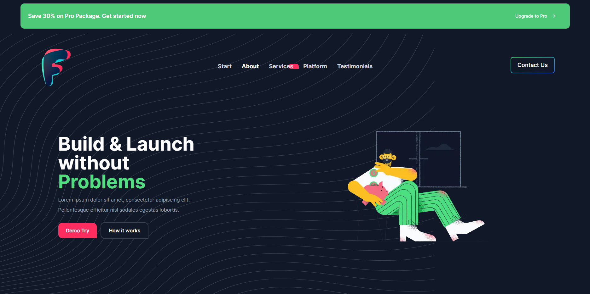
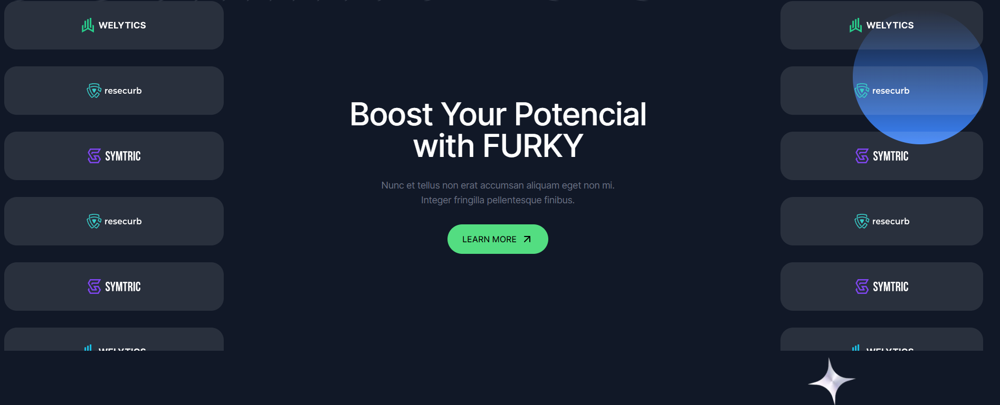
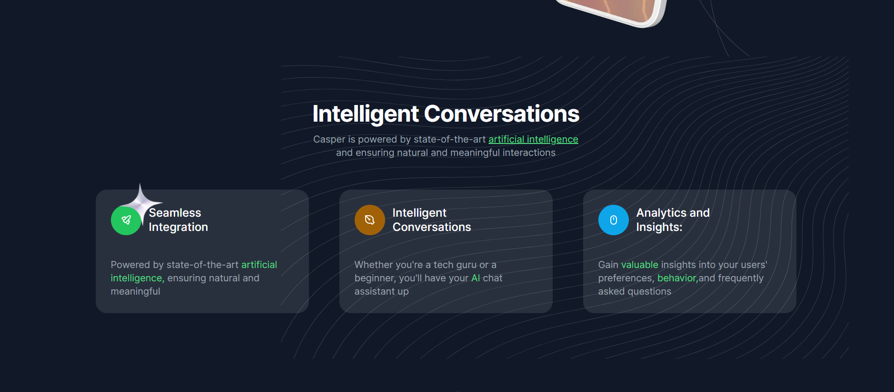
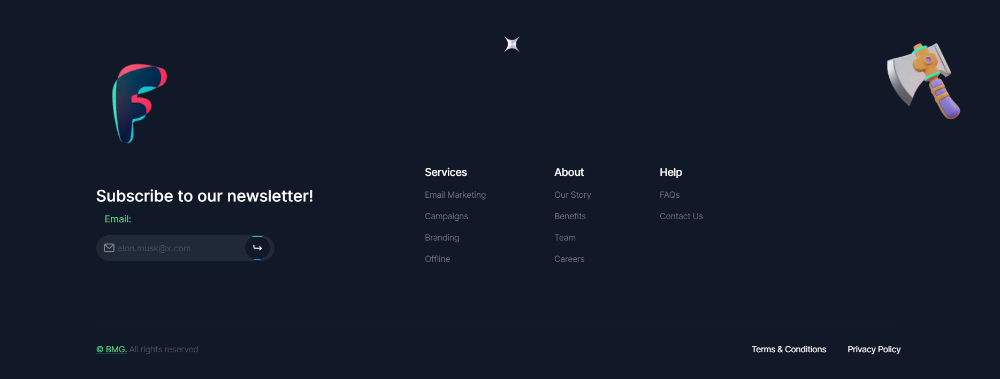

> [!IMPORTANT]
> Key information users need to know to achieve their goal.
<a href="https://furky.netlify.app" style="color:red; " > 🖤 Click to Check the Website. 🐈‍⬛ </a>


<a href="https://furky.netlify.app">  </a>
<a href="https://furky.netlify.app">  </a>
<a href="https://furky.netlify.app">  </a>
<a href="https://furky.netlify.app">  </a>
<a href="https://furky.netlify.app">  </a>


## Getting Started

First, run the development server:

```bash
npm run dev
# or
yarn dev
# or
pnpm dev
# or
bun dev
```
